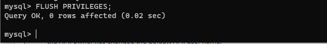

# Project-5 Documentations

## Implement a Client Server Architecture using MySQL Database Management System (DBMS)

`sudo apt install mysql-server -y`

`sudo systemctl enable mysql`

`sudo apt install mysql-client -y`

### Creating a new entry in ‘Inbound rules’ in ‘mysql server’ Security Groups

### Creating Database and User on mysql server

`sudo mysql_secure_installation`

`sudo mysql -p`

### Creating a User 

`CREATE USER 'remote_user'@'%' IDENTIFIED WITH mysql_native_password BY 'Password.1';`

### Creating a Database

`CREATE DATABASE test_db;`

Grant privileges to User

`GRANT ALL ON test_db.* TO 'remote_user'@'%' WITH GRANT OPTION;`

### Flush the privileges

`FLUSH PRIVILEGES;`

### Exit mysql

### Configure MySQL server to allow connections from remote hosts

`sudo vi /etc/mysql/mysql.conf.d/mysqld.cnf`

### Connection from mysql client Linux Server remotely to mysql server Database Engine without using SSH

`sudo mysql -u remote_user -h 172.31.90.223 -p`

`Show databases;`

